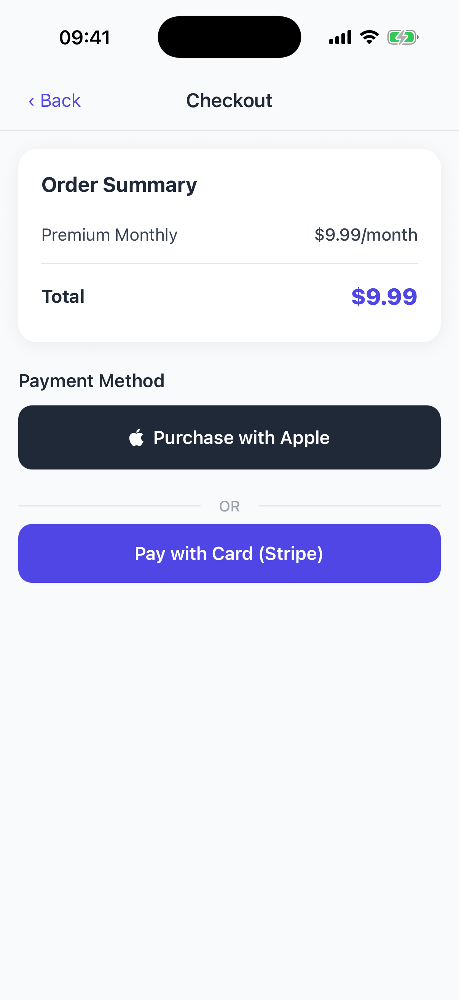
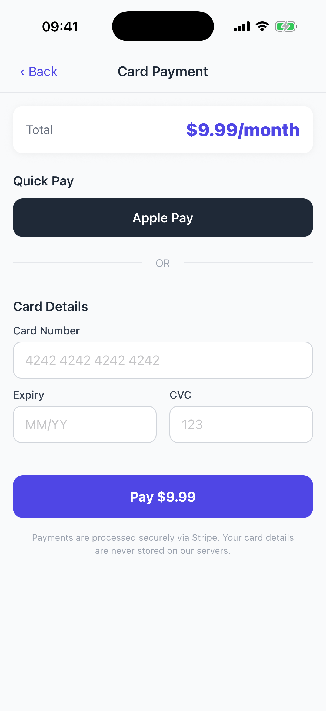
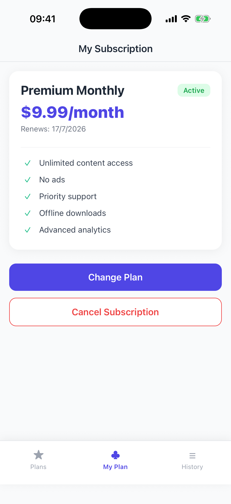
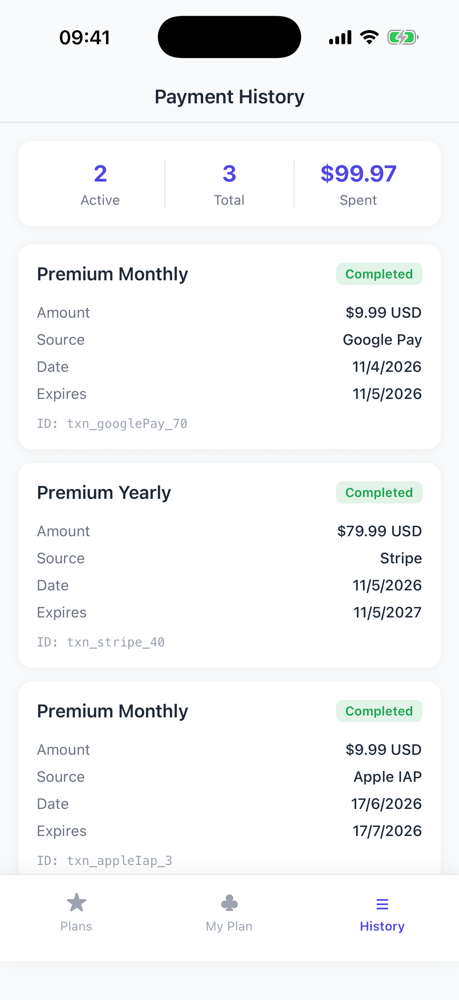
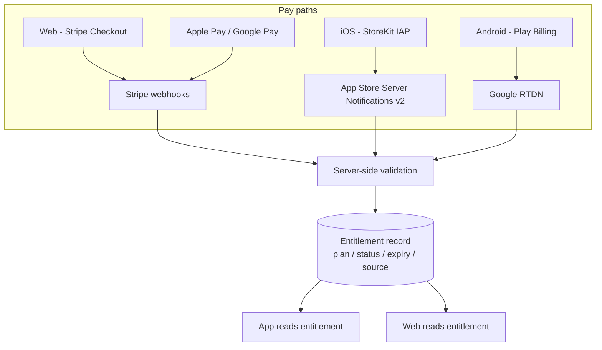

# Expo IAP + Stripe

A React Native (Expo) POC for cross-platform subscription monetisation: native
**In-App Purchases** (Apple IAP + Google Play Billing), **Apple Pay / Google Pay**,
and **Stripe** card payments behind one paywall, with a single source-of-truth
entitlement model so paid status stays in sync no matter how the user paid.

## Screenshots

| Paywall | Checkout | Card (Stripe) |
| :-----: | :------: | :-----------: |
|  |  |  |

| My Subscription | Payment History |
| :-------------: | :-------------: |
|  |  |

## What it shows

- **Paywall** with monthly / yearly plan comparison, savings badge and feature list.
- **Checkout** that routes the user to native IAP (Apple / Google) or to Stripe card.
- **Stripe card screen** with Apple Pay / Google Pay quick-pay and manual card entry.
- **My Subscription** showing the active plan, renewal date and cancel/change actions.
- **Payment History** aggregating purchases across every source (Apple IAP, Stripe,
  Google Pay) into one ledger with status, amount and transaction id.
- **Mock server-side receipt validation** and subscription management (grace periods).

## How paid status stays in sync

The store is never the source of truth - the backend entitlement record is. Every
purchase path writes to the same record, and both web and app read paid status from it.



## Architecture

- **State**: Zustand stores (`subscriptionStore`, `purchaseStore`, ...) with typed models.
- **Services**: `IapService` (react-native-iap), `StripeService` (PaymentSheet),
  `NativePayService` (Apple/Google Pay), `SubscriptionManager` (entitlement +
  history persistence via AsyncStorage), `ReceiptValidator` (mock server validation).
- **Navigation**: lightweight stack/tab navigator over the paywall, checkout,
  subscription and history screens.
- **Models**: `SubscriptionPlan`, `PurchaseRecord`, `PaymentMethod` with helpers.

## Run

```bash
npm install
npx expo run:ios      # or: npx expo run:android
```

## Stack

Expo / React Native, TypeScript, Zustand, react-native-iap, @stripe/stripe-react-native.
