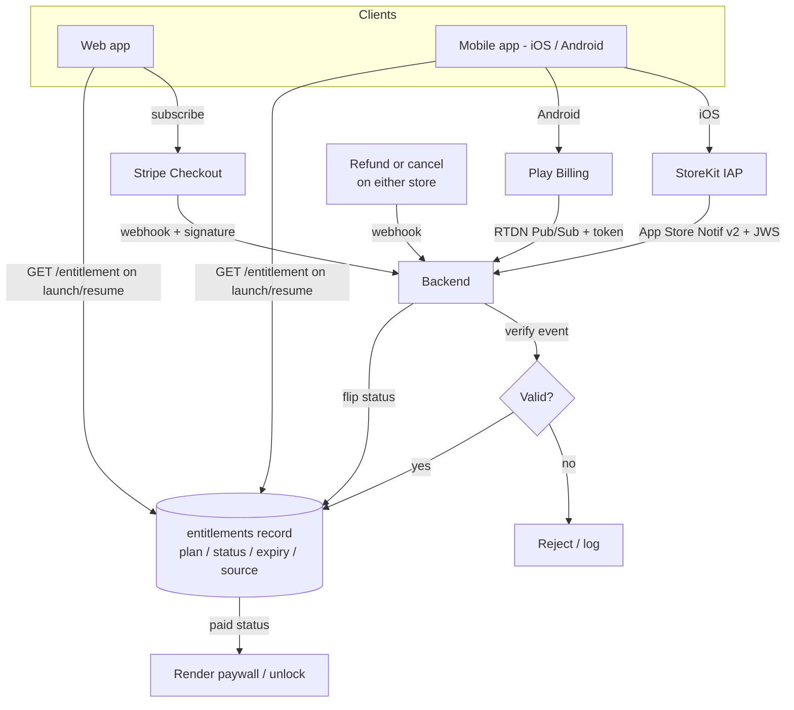

# Cross-Platform Entitlement Sync

How a user's paid status stays in sync across **web** and **app** when purchases
can come from Stripe (web), Apple StoreKit IAP (iOS), or Google Play Billing
(Android).

## Core principle

The store is never the source of truth the app trusts. **The backend is.**

There is exactly one `entitlements` record per user. Both web and app read paid
status from that record - never from a local receipt on the device.

```
entitlements(
  user_id,        -- internal account id (the join key)
  plan,           -- free | premium_monthly | premium_yearly
  status,         -- active | grace | expired | canceled
  expiry,         -- current period end
  source,         -- stripe | apple | google
  updated_at
)
```

## Why native IAP and Stripe both exist

Store rules require native IAP for in-app digital subscriptions - you cannot
bill those with Stripe inside the app. So:

- **Web** purchase -> Stripe Checkout / Billing
- **iOS** purchase -> StoreKit IAP
- **Android** purchase -> Google Play Billing

All three converge on the same single entitlement record.

## How the record gets written (server events)

Each store pushes asynchronous events to a backend webhook. Each event is
verified server-side, then upserted into the one record:

| Source | Event channel | Verification |
|---|---|---|
| Stripe | `checkout.session.completed`, `customer.subscription.updated`, `customer.subscription.deleted` | Stripe webhook signature |
| Apple | App Store Server Notifications v2 | JWS signature |
| Google | Real-time Developer Notifications (Pub/Sub) | Pub/Sub token + Play Developer API |

Receipts and tokens are validated **server-side, not on device**. A user who
paid on web is "Pro" the moment the app refreshes its entitlement; a refund or
cancel on either side flips them back the same way.

## Account linking

One internal `user_id` ties together:

- Stripe `customer_id`
- Apple `originalTransactionId`
- Google `purchaseToken`

That mapping is what lets the same person be recognized across web and app.

## Client read path

App and web both call `GET /entitlement`:

- on launch
- on resume / foreground
- right after a purchase completes

They render the paywall / unlock features from the response only. The device
receipt is never trusted directly.

## Edge cases

- **Refund / cancel** on either side -> webhook flips `status` -> next refresh
  locks the features.
- **Grace period** (billing retry) -> `status = grace`, access kept.
- **Offline** -> cache the last entitlement with a short TTL, re-verify on
  reconnect.

## Flow



## Where this lives in the POC

This repo demonstrates the native side of the flow with a mock backend:

- `src/services/ReceiptValidator.ts` - server-side receipt validation (Apple,
  Google, Stripe)
- `src/services/SubscriptionManager.ts` - the single entitlement record
- `src/mock/mockBackend.ts` - simulated server endpoints the clients read from
