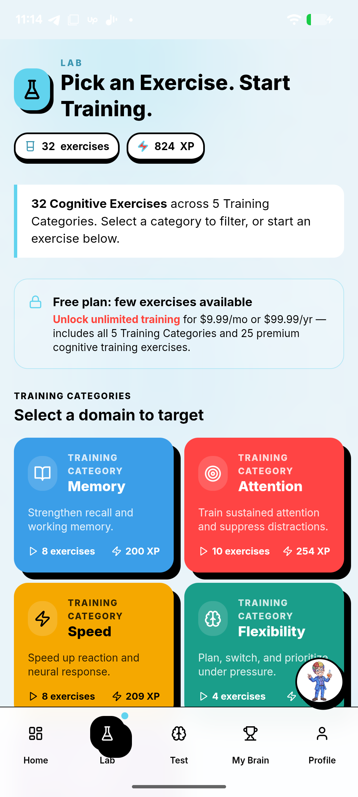
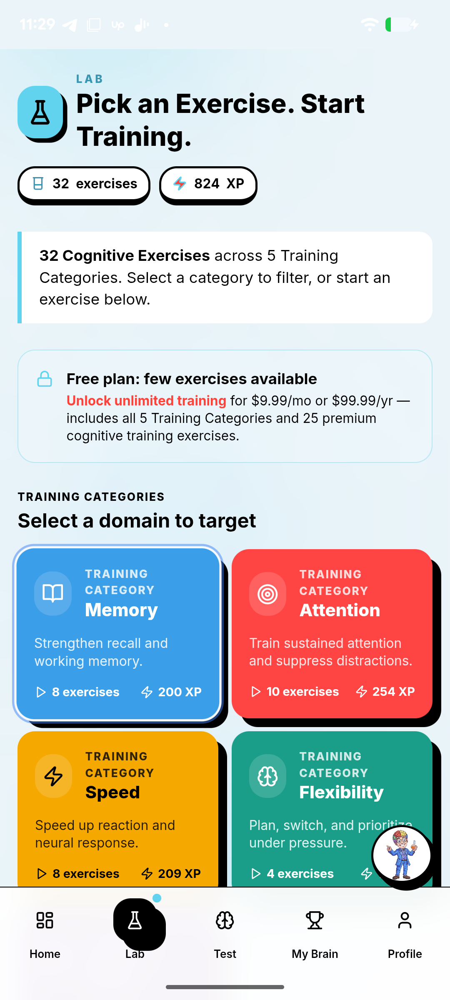
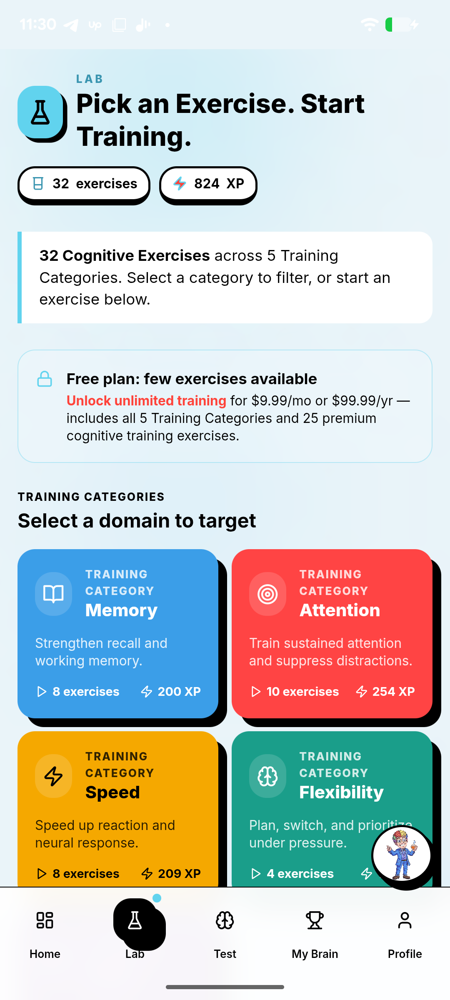
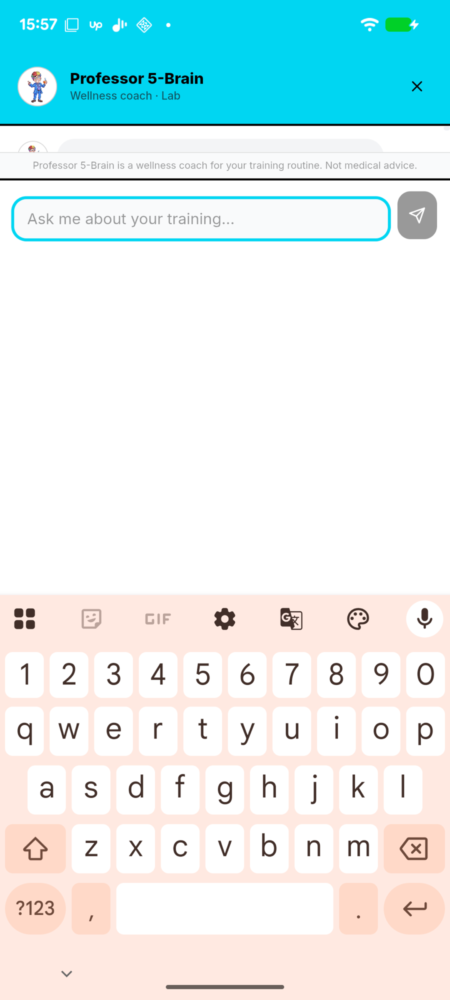
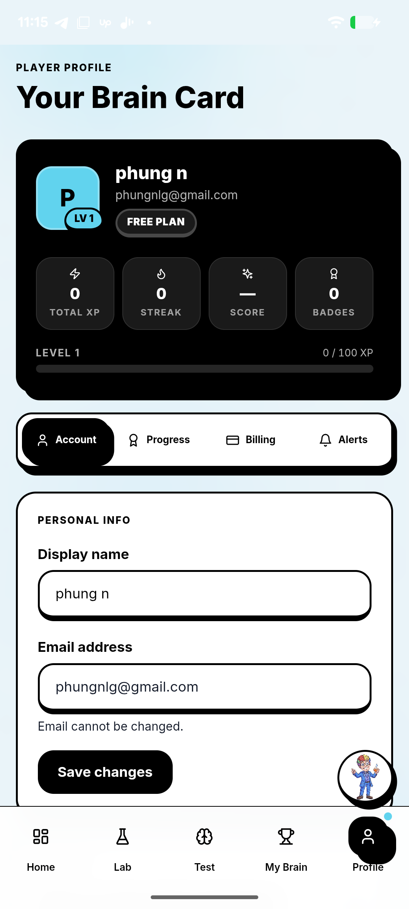
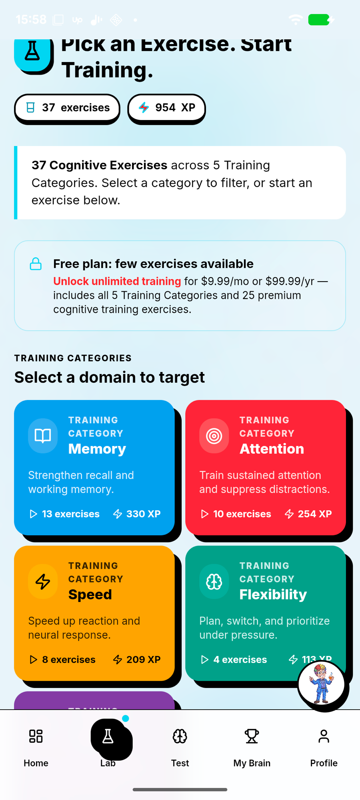

# Nutropx Lab - QA Findings

**Build:** v1.2 (versionCode 3) - `com.nutropx.lab`
**Stack:** Capacitor wrapper around a Next.js static export (`webDir: out`), arm64-v8a only
**Device:** Pixel 7a, Android 16, 1080x2400 @ 420dpi, System WebView 148
**Account:** Free plan, Level 1 - **Tools:** Maestro 2.6.1 + adb
**Screenshots:** all referenced PNGs live in [`screenshots/`](screenshots/) (click any to view)

---

## 1. Bug list

### BUG-1 (Blocker) - Exercise catalog does not scroll; no exercise can be started
- **Steps:**
  1. Open app -> tap **Lab** (or Home -> "Start Training").
  2. Page "Pick an Exercise. Start Training." shows 5 category cards; Speed/Flexibility clipped at bottom.
  3. Swipe up to reach the exercise tiles.
- **Expected:** page scrolls to the 32 exercise tiles (incl. free Number Memory / Stroop) + Start.
- **Actual:** page does not move at all. Verified 2x adb swipe + 2x Maestro swipe (50%,80%->50%,20%). Free user can never open an exercise.
- **Note:** tapping a category (e.g. Memory) correctly filters the list in the DOM, but filtered tiles are still below the unscrollable fold.
- **Screens:**

| Lab (top, won't scroll) | After 2x swipe (identical) | Home CTA -> same stuck page |
|---|---|---|
|  |  |  |

### BUG-2 (Medium) - Chat: message bubble + input field overlap the disclaimer banner
- **Steps:**
  1. Tap the Professor 5-Brain chat FAB.
  2. Observe the area between the cyan header and the input field.
- **Expected:** message list, disclaimer banner, and the input field sit in separate, non-overlapping rows.
- **Actual:** the first message bubble (avatar + empty rounded bubble) renders clipped **behind** the "Professor 5-Brain is a wellness coach... Not medical advice." disclaimer, and the input textfield sits directly on top of the same band - the chat header/disclaimer/input rows are stacked with no spacing and overlap each other.
- **Impact:** broken, unpolished chat layout; the clipped bubble looks like a rendering glitch.
- **Likely cause:** the chat panel uses absolute/fixed positioning (or a `100vh`/`100dvh` container under the overlaid status bar - same family as BUG-1) so the scroll list, sticky disclaimer, and input collide instead of using a flex column with `min-height:0`.
- **Screens:** clipped bubble behind disclaimer + input overlapping the band:

### BUG-3 (Medium) - Chat FAB overlaps the "Profile" bottom-nav tab
- **Steps:** any screen with bottom nav -> look bottom-right.
- **Expected:** chat launcher clear of nav targets.
- **Actual:** Professor 5-Brain avatar bubble sits over the Profile tab -> mis-tap / blocked target.
- **Screens:** avatar bubble over Profile tab (bottom-right):

### BUG-5 (Medium) - Lab title overlaps the flask icon and is clipped under the status bar
- **Steps:**
  1. Tap **Lab**.
  2. Look at the top heading "Pick an Exercise. Start Training."
- **Expected:** the heading sits clear of the lab/flask icon and below the status bar with safe-area padding.
- **Actual:** the heading text runs over the flask icon (top-left), and the first line is clipped under the system status bar / notch - no top safe-area inset.
- **Impact:** broken, unreadable page header on the main catalog screen.
- **Likely cause:** `StatusBar.overlaysWebView: true` with no `env(safe-area-inset-top)` padding, plus the title and icon sharing a container without spacing (same root family as BUG-1).
- **Screens:** title over flask icon + clipped at top:

---

## 3. Top 3 concerns (inferred from behavior) + fix approach

### Concern 1 - The overlap/scroll defects are one systemic viewport + safe-area bug
- **Why I think so:** BUG-1 (catalog won't scroll), BUG-2 (chat bubble/input overlap), and BUG-5 (title clipped under the status bar) all share a root. The config sets `StatusBar.overlaysWebView: true` and an immersive splash, and iOS explicitly sets `scrollEnabled: true` / `contentInset: "never"` while Android sets **no** scroll/inset config. Classic symptom: a `height: 100vh` (or `100dvh`) container under a transparent overlaid status bar miscalculates available height with no safe-area padding, so content clips, overlaps, and has nowhere to scroll.
- **How I'd fix:**
  1. Connect Chrome DevTools (`chrome://inspect`) to the running WebView and inspect each screen's scroll container computed height vs. content height. (Prod has `webContentsDebuggingEnabled:false`, so build a debug variant.)
  2. Repro in Chrome mobile emulation at 412x915; replace `100vh` with `100dvh` + `env(safe-area-inset-*)` padding, or set `overflow-y:auto; min-height:0` on the flex scroll child.
  3. Re-test every long page (Lab, My Brain, Profile sub-tabs, chat), not just the catalog - one fix likely clears BUG-1/2/5.

### Concern 2 - Core loop reachable only by a side path; the main entry points dead-end
- **Why I think so:** the playable engine works - an exercise launches and runs fine via **Test -> Quick Check-In -> Start Round**. But both *primary* entry points (Lab catalog tile, Home "Start Training") dead-end on the unscrollable catalog (BUG-1), so a normal user can't start a named exercise. That a build shipped with the main CTA broken while a side path works suggests gameplay launch isn't covered by automated/device testing on this form factor.
- **How I'd fix:**
  1. After Concern 1, add a smoke test that launches each free exercise from the catalog and asserts the game canvas renders + score updates - run it in CI on a real-device cloud (arm64).
  2. Add `data-testid` hooks so the test is stable despite WebView a11y limitations (a11y nodes report zero bounds).
  3. Gate releases on that smoke test so "can't start a game from the catalog" can never ship again.

### Concern 3 - Security/config hygiene on the Android WebView bridge
- **Why I think so:** `android.allowMixedContent: true` lets an HTTPS page load HTTP sub-resources (MITM/inject risk). The app also bundles `@capacitor/push-notifications` (push token handling) and `@capacitor/preferences` (local storage of session/state). Good signs: `cleartext:false`, `webContentsDebuggingEnabled:false`. But mixed content + a Capacitor native bridge is the classic injection surface.
- **How I'd fix:**
  1. Set `allowMixedContent: false`; fix any HTTP asset URLs to HTTPS.
  2. Confirm any external links open via `@capacitor/browser` (system tab), not in the app WebView, and restrict the bridge to the bundled origin (`server.androidScheme: https` is set - verify no remote allowlist).
  3. Verify push token + any auth/session in `@capacitor/preferences` is not written to world-readable storage; review what the bridge exposes to the web layer.
  4. Add x86_64 ABI so security/QA tooling can run in emulators.