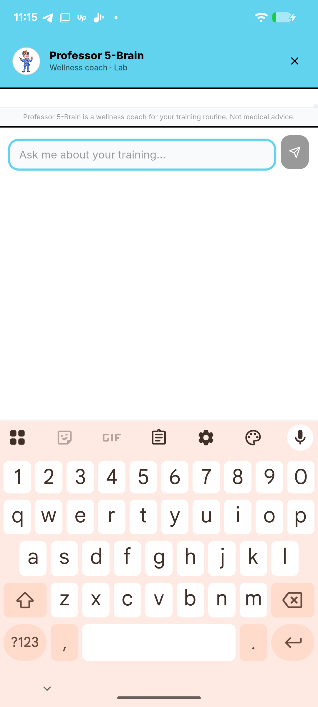
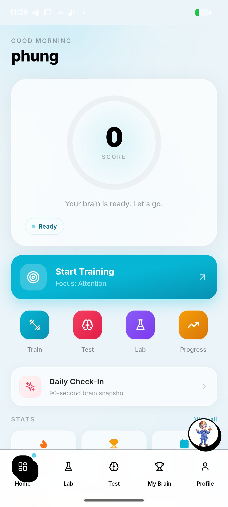
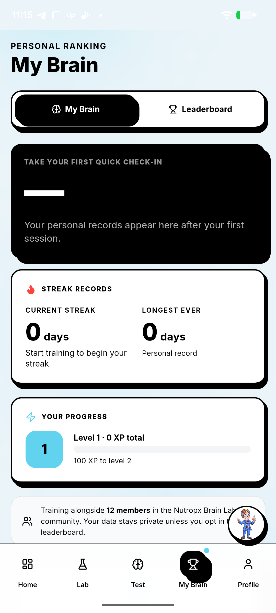

# Nutropx Lab - QA Findings

**Build:** v1.2 (versionCode 3) - `com.nutropx.lab`
**Stack:** Capacitor wrapper around a Next.js static export (`webDir: out`), arm64-v8a only
**Device:** Pixel 7a, Android 16, 1080x2400 @ 420dpi, System WebView 148
**Account:** Free plan, Level 1 - **Tools:** Maestro 2.6.1 + adb
**Screenshots:** all referenced PNGs live in [`screenshots/`](screenshots/) (click any to view)

---

## 1. Bug list

### BUG-1 (Blocker) - Exercise catalog does not scroll; no exercise can be started
- **Steps:**
  1. Open app -> tap **Lab** (or Home -> "Start Training").
  2. Page "Pick an Exercise. Start Training." shows 5 category cards; Speed/Flexibility clipped at bottom.
  3. Swipe up to reach the exercise tiles.
- **Expected:** page scrolls to the 32 exercise tiles (incl. free Number Memory / Stroop) + Start.
- **Actual:** page does not move at all. Verified 2x adb swipe + 2x Maestro swipe (50%,80%->50%,20%). Free user can never open an exercise.
- **Note:** tapping a category (e.g. Memory) correctly filters the list in the DOM, but filtered tiles are still below the unscrollable fold.
- **Screens:**

| Lab (top, won't scroll) | After 2x swipe (identical) | Home CTA -> same stuck page |
|---|---|---|
|  |  |  |

### BUG-2 (Medium) - Blank screen flash for ~2-3s on launch / tab switch
- **Steps:** cold-launch the app, watch the screen.
- **Expected:** splash holds until content paints, or a skeleton shows.
- **Actual:** native splash auto-hides at 2s (`SplashScreen.launchShowDuration:2000`), but the WebView body is still unpainted -> blank screen w/ spinner for ~1-2s more.
- **Screens:** Home renders correctly once content paints:


### BUG-3 (Medium) - Chat FAB overlaps the "Profile" bottom-nav tab
- **Steps:** any screen with bottom nav -> look bottom-right.
- **Expected:** chat launcher clear of nav targets.
- **Actual:** Professor 5-Brain avatar bubble sits over the Profile tab -> mis-tap / blocked target.
- **Screens:** avatar bubble over Profile tab (bottom-right):


### BUG-4 (Low) - Professor 5-Brain chat opens with an empty body
- **Steps:** tap the chat FAB.
- **Expected:** a welcome/intro message.
- **Actual:** header + input + disclaimer only; conversation area blank.
- **Screens:** empty conversation body on open:



### Verified OK (not bugs)
- No crashes/ANRs across smoke + deep + force-stop/relaunch + network toggles (only a benign `cr_AutofillHintsService` chromium log).
- Offline: relaunched with Wi-Fi + data off, Home rendered from bundled assets, no error.
- All 5 tabs load; Test = fullscreen Quick Check-In with back arrow, nav hidden as intended.
- Portrait-locked (forced rotation ignored) - acceptable.

| Offline (no network) | Test - Quick Check-In | My Brain |
|---|---|---|
|  |  |  |

---

## 2. Top improvement notes

**UX**
- Loading: replace the 2s fixed splash + blank gap with a skeleton tied to first contentful paint (BUG-2).
- The catalog buries 32 exercises under 5 category cards with no visible "scroll for more" affordance - even once scrolling is fixed, surface featured/free exercises above the fold.
- Chat FAB should not sit on the nav row (BUG-3); float it higher or dock it.
- Empty chat on open feels broken - seed an intro bubble + 2-3 suggested prompts (BUG-4).
- Free vs PRO: lots of PRO tiles with "Upgrade to unlock" + product cards ($59-$99 supplements) inline with exercises - reads more storefront than trainer; consider separating store from training.

**Performance**
- arm64-only APK: won't install on x86/x86_64 emulators - blocks a chunk of QA/CI farms and some Chromebooks. Add x86_64 (Capacitor/WebView supports it) or document the constraint.
- Static Next.js export is bundled locally (good for cold start), but the WebView still shows a paint gap - audit JS bundle/hydration cost on first route.
- `allowMixedContent: true` (Android) - see Concern 3.

**Accessibility / testability**
- WebView a11y nodes report zero bounds, so coordinate automation/assistive tech can't target tiles reliably. Add stable `data-testid` / proper ARIA + ensure native a11y bounds, which also unblocks automated regression for gameplay.

---

## 3. Top 3 concerns (inferred from behavior) + fix approach

### Concern 1 - The scroll blocker is a viewport/height bug, likely systemic across the WebView
- **Why I think so:** the config sets `StatusBar.overlaysWebView: true` and an immersive splash, and iOS explicitly sets `scrollEnabled: true` / `contentInset: "never"` while Android sets **no** scroll/inset config. Classic symptom: a `height: 100vh` (or `100dvh`) container under a transparent overlaid status bar miscalculates available height, so an inner `overflow:hidden`/fixed-height wrapper clips content with nowhere to scroll. If the catalog hit this, other long pages will too.
- **How I'd fix:**
  1. Connect Chrome DevTools (`chrome://inspect`) to the running WebView and inspect the catalog's scroll container computed height vs. content height. (Prod has `webContentsDebuggingEnabled:false`, so build a debug variant.)
  2. Repro in Chrome mobile emulation at 412x915; replace `100vh` with `100dvh` + `env(safe-area-inset-*)` padding, or set `overflow-y:auto; min-height:0` on the flex scroll child.
  3. Re-test every long page (Lab, My Brain, Profile sub-tabs), not just the catalog.

### Concern 2 - No working path to actually start/play an exercise (core loop unverified by the team?)
- **Why I think so:** both entry points (Lab catalog and Home "Start Training") dead-end on the same unscrollable page. A shipped build where the primary action is unreachable suggests gameplay launch isn't covered by automated/device testing, and likely wasn't smoke-tested on this form factor.
- **How I'd fix:**
  1. After Concern 1, add a smoke test that launches each free exercise and asserts the game canvas renders + a score updates - run it in CI on a real-device cloud (arm64).
  2. Add `data-testid` hooks so the test is stable despite WebView a11y limitations.
  3. Gate releases on that smoke test so "can't start a game" can never ship again.

### Concern 3 - Security/config hygiene on the Android WebView bridge
- **Why I think so:** `android.allowMixedContent: true` lets an HTTPS page load HTTP sub-resources (MITM/inject risk). The app also bundles `@capacitor/push-notifications` (push token handling) and `@capacitor/preferences` (local storage of session/state). Good signs: `cleartext:false`, `webContentsDebuggingEnabled:false`. But mixed content + a Capacitor native bridge is the classic injection surface.
- **How I'd fix:**
  1. Set `allowMixedContent: false`; fix any HTTP asset URLs to HTTPS.
  2. Confirm any external links open via `@capacitor/browser` (system tab), not in the app WebView, and restrict the bridge to the bundled origin (`server.androidScheme: https` is set - verify no remote allowlist).
  3. Verify push token + any auth/session in `@capacitor/preferences` is not written to world-readable storage; review what the bridge exposes to the web layer.
  4. Add x86_64 ABI so security/QA tooling can run in emulators.

---

## Coverage gap (be transparent)
Actual **gameplay** was never reached - blocked by BUG-1 plus zero-bounds WebView a11y (no coordinate tap). **Login/signup, in-app purchase, push, deep links** untested. Recommend re-running gameplay + auth suites once BUG-1 is fixed.

## All screenshots

All 21 captures are in [`screenshots/`](screenshots/).

## Re-run

```bash
~/.maestro/bin/maestro test qa.yaml       # smoke: 5 tabs + chat
~/.maestro/bin/maestro test qa_deep.yaml  # deep: exposes BUG-1
```
